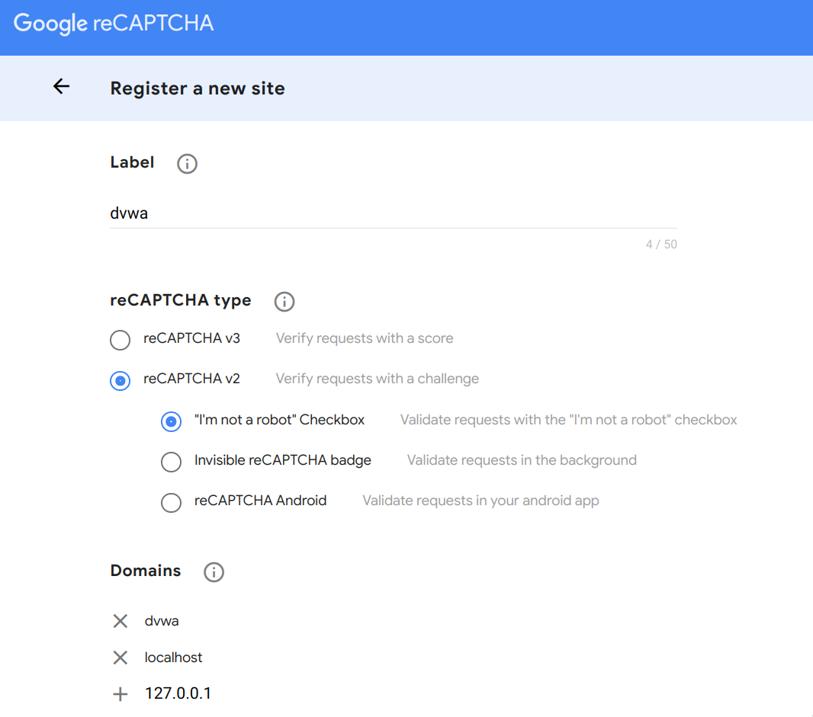
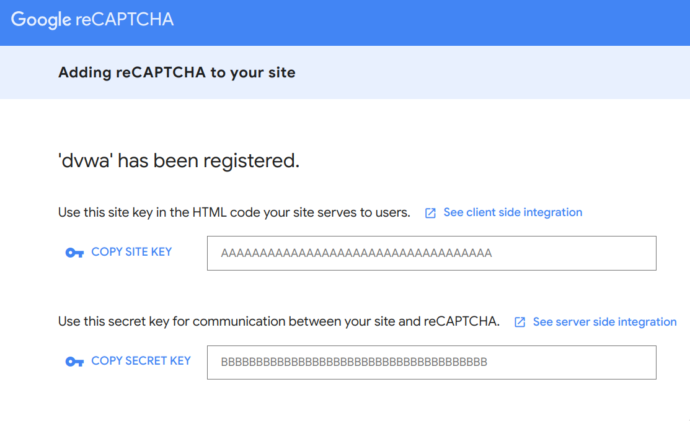

# Dockerized [DVWA](https://github.com/digininja/DVWA)

**[Install](#tada-install)** |
**[Start](#zap-start)** |
**[Stop](#no_entry_sign-stop)** |
**[Usage](#computer-usage)** |
**[Configuration](#wrench-configuration)** |
**[FAQ](#bulb-faq)** |
**[Sec Tools](#lock-cytopia-sec-tools)** |
**[License](#page_facing_up-license)**

DVWA has an official Docker image available at [Dockerhub](https://hub.docker.com/r/vulnerables/web-dvwa/), however by the time of writing this image did not receive any updates for 2 years.

If you prefer an always up-to-date version, use the here provided Docker Compose setup. The image will always be built locally against the latest master branch of the [DVWA](https://github.com/digininja/DVWA) repository.


## :tada: Install

Download repository and copy `.env` file
```bash
git clone https://github.com/cytopia/docker-dvwa
cd docker-dvwa
cp .env-example .env
```

## :zap: Start
```bash
make start
```


## :no_entry_sign: Stop
```bash
make stop
```


## :computer: Usage

After typing `make start` you can access DVWA in your browser via:

* Url: http://localhost:8000
* User: `admin`
* Pass: `password`

You can also get a shell on the web server container via:
```bash
make enter
```

View all avalable options:
```bash
make help
```


## :wrench: Configuration

This setup allows you to configure a few settings via the `.env` file.

| Variable             | Default | Settings |
|----------------------|---------|----------|
| `LISTEN_PORT       ` | `8000`  | Local port for the web server to listen on |
| `RECAPTCHA_PRIV_KEY` |         | Required to make the captcha module work. (See `.env-example` for instructions) |
| `RECAPTCHA_PUB_KEY`  |         | Required to make the captcha module work. (See `.env-example` for instructions) |
| `PHP_DISPLAY_ERRORS` | `0`     | Show PHP errors on the website (if you want a really easy mode) |

The following env variables are default settings and their values can also be changed from within the web interface:

| Variable         | Default  | Settings |
|------------------|----------|----------|
| `SECURITY_LEVEL` | `medium` | Adjust the difficulty of the challenges |
| `PHPIDS_ENABLED` | `0`      | Enable PHP Web Application Firewall / Intrusion Detection System (off by default) |
| `PHPIDS_VERBOSE` | `0`      | Enabling this will show why the WAF blocked the request on the blocked request. |

**Important:** For the `SECURITY_LEVEL` changes to take effect, you will have to clear your cookies. Alternatively change it in the web interface.


## :bulb: FAQ

* **Q:** I want to proxy through [BurpSuite](https://portswigger.net/burp), but it does not work on `localhost` or `127.0.01`.<br/>
  **A:** Browsers ususally bypass `localhost` or `127.0.01` for proxy traffic. One solution is to add an alternative hostname to `/etc/hosts` and access the application through that.<br/>
  `/etc/hosts`:
  ```bash
  127.0.0.1  dvwa
  ```
  Then use http://dvwa:8000 in your browser.

* **Q:** How can I reset the database and start fresh?<br/>
  **A:** The database uses a Docker volume and you can simply remove it via:<br/>
  ```bash
  # the command below will stop all running container,
  # remove their state and delete the MySQL docker volume.
  make reset
  ```
* **Q:** How do I setup the recaptcha key?<br/>
  **A:** Go to https://www.google.com/recaptcha/admin and generate your captcha as shown below:<br/>
  <br/>
  * Ensure to choose `reCaptcha v2`
  * Ensure to add *all* domains you plan on using

  <br/>
  * Add `SITE KEY` to the `RECAPTCHA_PUB_KEY` variable in your `.env` file
  * Add `SECRET KEY` to the `RECAPTCHA_PRIV_KEY` variable in your `.env` file


## :lock: [cytopia](https://github.com/cytopia) sec tools

Below is a list of sec tools and docs I am maintaining, which might come in handy working on DVWA..

| Name                 | Category             | Language   | Description |
|----------------------|----------------------|------------|-------------|
| **[offsec]**         | Documentation        | Markdown   | Offsec checklist, tools and examples |
| **[header-fuzz]**    | Enumeration          | Bash       | Fuzz HTTP headers |
| **[smtp-user-enum]** | Enumeration          | Python 2+3 | SMTP users enumerator |
| **[urlbuster]**      | Enumeration          | Python 2+3 | Mutable web directory fuzzer |
| **[pwncat]**         | Pivoting             | Python 2+3 | Cross-platform netcat on steroids |
| **[badchars]**       | Reverse Engineering  | Python 2+3 | Badchar generator |
| **[fuzza]**          | Reverse Engineering  | Python 2+3 | TCP fuzzing tool |

[offsec]: https://github.com/cytopia/offsec
[header-fuzz]: https://github.com/cytopia/header-fuzz
[smtp-user-enum]: https://github.com/cytopia/smtp-user-enum
[urlbuster]: https://github.com/cytopia/urlbuster
[pwncat]: https://github.com/cytopia/pwncat
[badchars]: https://github.com/cytopia/badchars
[fuzza]: https://github.com/cytopia/fuzza


## :page_facing_up: License

**[MIT License](LICENSE.md)**

Copyright (c) 2021 **[cytopia](https://github.com/cytopia)**
