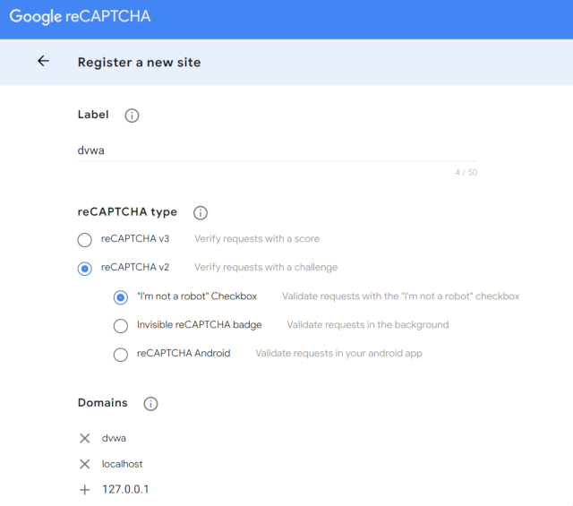
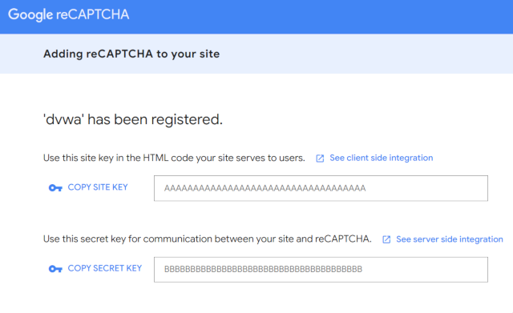
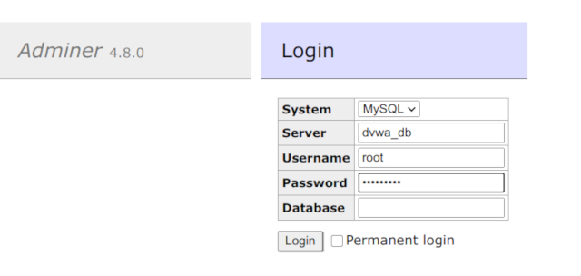

# Dockerized DVWA

**[Install](#tada-install)** |
**[Start](#zap-start)** |
**[Stop](#no_entry_sign-stop)** |
**[Usage](#computer-usage)** |
**[Features](#star-features)** |
**[Configuration](#wrench-configuration)** |
**[Capture the flag](#pirate_flag-capture-the-flag)** |
**[Tools](#gear-tools)** |
**[FAQ](#bulb-faq)** |
**[Sec Tools](#lock-cytopia-sec-tools)** |
**[License](#page_facing_up-license)**

[](https://github.com/cytopia/docker-dvwa/releases)
[](https://github.com/cytopia/docker-dvwa/actions?query=workflow%3Abuild)
[](https://github.com/cytopia/docker-dvwa/actions?query=workflow%3Anightly)
[](https://hub.docker.com/r/cytopia/dvwa)
[](https://github.com/cytopia/docker-dvwa "github.com/cytopia/docker-dvwa")
[](https://opensource.org/licenses/MIT)

> Damn Vulnerable Web Application (DVWA) is a PHP/MySQL web application that is damn vulnerable. Its main goal is to be an aid for security professionals to test their skills and tools in a legal environment, help web developers better understand the processes of securing web applications and to aid both students & teachers to learn about web application security in a controlled class room environment.
>
> https://github.com/digininja/DVWA

[DVWA](https://github.com/digininja/DVWA) has an official Docker image available at [Dockerhub](https://hub.docker.com/r/vulnerables/web-dvwa/), however by the time of writing this image did not receive any recent updates.

If you need an always up-to-date version or **`arm64`** images, you can use the here provided Docker Compose setup. The image is built every night against the latest master branch of the [DVWA](https://github.com/digininja/DVWA) and pushed to [Dockehub](https://hub.docker.com/r/cytopia/dvwa).

Additionally this Docker image comes with a few **CTF challenges** that require you to completely compromise the machine and reach root access. [Read here](#pirate_flag-capture-the-flag) for details.


**Available Architectures:**  `amd64`, `arm64`


## :whale: Available Docker image versions

[](https://hub.docker.com/r/cytopia/dvwa)
[](https://hub.docker.com/r/cytopia/dvwa)

#### Rolling releaess

The following Docker image tags are rolling releases and are built and updated every night.

[](https://github.com/cytopia/docker-dvwa/actions?query=workflow%3Anightly)


| Docker Tag            | Git Ref      | PHP         | Available Architectures                      |
|-----------------------|--------------|-------------|----------------------------------------------|
| **`latest`**          | master       | latest      | `amd64`, `arm64` |
| `php-8.1`             | master       | **`8.1`**   | `amd64`, `arm64` |
| `php-8.0`             | master       | **`8.0`**   | `amd64`, `arm64` |
| `php-7.4`             | master       | **`7.4`**   | `amd64`, `arm64` |
| `php-7.3`             | master       | **`7.3`**   | `amd64`, `arm64` |
| `php-7.2`             | master       | **`7.2`**   | `amd64`, `arm64` |
| `php-7.1`             | master       | **`7.1`**   | `amd64`, `arm64` |
| `php-7.0`             | master       | **`7.0`**   | `amd64`, `arm64` |
| `php-5.6`             | master       | **`5.6`**   | `amd64`, `arm64` |


## :tada: Install
Clone repository from GitHub:
```bash
git clone https://github.com/cytopia/docker-dvwa
```


## :zap: Start
Inside the cloned repository (`docker-dvwa/` directory):
```bash
make start
```


## :no_entry_sign: Stop
Inside the cloned repository (`docker-dvwa/` directory):
```bash
make stop
```


## :computer: Usage

After running `make start` you can access DVWA in your browser via:

* Url: http://localhost:8000
* User: `admin`
* Pass: `password`


## :star: Features

* :whale: - Works out of the box on Linux, MacOS and Windows via Docker
* :elephant: - Comes in flavours of all common [PHP version](#wrench-configuration)
* :pirate_flag: - Enhances DVWA with [local exploitation](#pirate_flag-capture-the-flag) challenges
* :repeat: - Docker images are [updated every night](https://hub.docker.com/r/cytopia/dvwa) against [DVWA](https://github.com/digininja/DVWA) master branch
* :open_file_folder: - Bundles [Adminer](https://www.adminer.org/) to inspect the database


## :wrench: Configuration

This setup allows you to configure a few settings via the `.env` file.

| Variable             | Default | Settings |
|----------------------|---------|----------|
| `PHP_VERSION`        | `8.1`   | PHP version to run DVWA (`5.6`, `7.0`, `7.1`, `7.2`, `7.3`, `7.4`, `8.0` or `8.1`) |
| `LISTEN_PORT`        | `8000`  | Local port for the web server to listen on |
| `RECAPTCHA_PRIV_KEY` |         | Required to make the captcha module work. (See [FAQ](#bulb-faq) section below) |
| `RECAPTCHA_PUB_KEY`  |         | Required to make the captcha module work. (See [FAQ](#bulb-faq) section below) |
| `PHP_DISPLAY_ERRORS` | `0`     | Set to `1` to display PHP errors (if you want a really easy mode) |

The following `.env` file variables are default settings and their values can also be changed from within the web interface:

| Variable         | Default  | Settings |
|------------------|----------|----------|
| `SECURITY_LEVEL` | `medium` | Adjust the difficulty level for the challenges<sup>[1]</sup><br/> (`low`, `medium`, `high` or `impossible`) |
| `PHPIDS_ENABLED` | `0`      | Set to `1` to enable PHP WAF/IDS<sup>[2]</sup> (off by default) |
| `PHPIDS_VERBOSE` | `0`      | Set to `1` to display WAF/IDS reasons for blocked requests |

> <sup>[1]</sup> For the `SECURITY_LEVEL` changes to take effect, you will have to clear your cookies. Alternatively change it in the web interface.<br/>
> <sup>[2]</sup> WAF (Web Application Firewall) / IDS (Intrusion Detection System)


## :pirate_flag: Capture the flag

Additionally to the default DVWA features, this flavour also contains a few flags that can be captured via various means (including local privilege escalation).

* Flag 1: `flag{b9bbcb33e11b80be759c4e844862482d}`
* Flag 2: `flag{fc3fd58dcdad9ab23faca6e9a36e581c}`
* Flag 3: `flag{eca7d1f3cf60a8b5344a49287b9076e4}`

**How to play?**

* :heavy_check_mark: You must gain access to the running Docker container through the web application.
* **:no_entry: You cannot use `docker exec -it dvwa_web bash` to gain access**

Let me know on :bird: [Twitter](https://twitter.com/everythingcli) if you've solved them and how easy/difficult they were.


## :gear: Tools

The DVWA Docker image contains the following tools assisting you in solving the challenges and also allowing you to gain access via reverse shells.

* `bash`
* `netcat`
* `ping`
* `sudo`
* `telnet`
* `python3`


## :bulb: FAQ

<details><summary><strong>Q:</strong> I want to proxy through <a href="https://portswigger.net/burp">BurpSuite</a>, but it does not work on <code>localhost</code> or <code>127.0.0.1</code>.</summary>
<p><br/>
Browsers ususally bypass <code>localhost</code> or <code>127.0.0.1</code> for proxy traffic. One solution is to add an alternative hostname to <code>/etc/hosts</code> and access the application through that.<br/><br/>
<code>/etc/hosts</code>:

```bash
127.0.0.1  dvwa
```

Then use <a href="http://dvwa:8000">http://dvwa:8000</a> in your browser.
</p>
</details>


<details><summary><strong>Q:</strong> How can I run DVWA with a different PHP version?</summary>
<p><br/>
The here provided Docker images are built against all common PHP versions and you can easily select your version of choice in the <a href="https://github.com/cytopia/docker-dvwa/blob/master/.env-example#L1">.env</a> prior startup. To do so, just uncomment the version of choice and restart the Docker Compose stack:<br/>
<code>.env</code>

```bash
# PHP VERSION
# -----------
# Uncomment one of the PHP versions you want to use for DVWA
#PHP_VERSION=5.6
#PHP_VERSION=7.0
#PHP_VERSION=7.1
#PHP_VERSION=7.2
#PHP_VERSION=7.3
#PHP_VERSION=7.4
#PHP_VERSION=8.0
PHP_VERSION=8.1
```
</p>
</details>


<details><summary><strong>Q:</strong> How can I reset the database and start fresh?</summary>
<p><br/>
The database uses a Docker volume and you can simply remove it via:<br/>

```bash
# the command below will stop all running container,
# remove their state and delete the MySQL docker volume.
make reset
```
</p>
</details>


<details><summary><strong>Q:</strong> How can I view Apache access or error log files?</summary>
<p><br/>
Log files are piped to <i>stderr</i> from the Docker container and you can view them via:<br/>

```bash
make logs
```
</p>
</details>


<details><summary><strong>Q:</strong> How can I get a shell on the web server container?</summary>
<p><br/>
  <strong> Note:</strong> Doing so is basically cheating, you are supposed to gain access to the machine via exploitation.<br/><br/>
You can enter the running web server container as root via:<br/>

```bash
make enter
```
</p>
</details>


<details><summary><strong>Q:</strong> How do I setup the reCAPTCHA key?</summary>
<p><br/>
  Go to <a href="https://www.google.com/recaptcha/admin">https://www.google.com/recaptcha/admin</a> and generate your captcha as shown below:<br/>
  <ul>
   <li>Ensure to choose <code>reCAPTCHA v2</code></li>
   <li>Ensure to add <i>all</i> domains you plan on using</li>
  </ul>
  <a href="doc/captcha-01.png"></a>
  <ul>
   <li>Add <code>SITE KEY</code> to the <code>RECAPTCHA_PUB_KEY</code> variable in your <code>.env</code> file</li>
   <li>Add <code>SECRET KEY</code> to the <code>RECAPTCHA_PRIV_KEY</code> variable in your <code>.env</code> file</li>
  </ul>
  <a href="doc/captcha-02.png"></a>
</p>
</details>


<details><summary><strong>Q:</strong> How can I access/view the MySQL database?</summary>
<p><br/>
  <strong> Note:</strong> Doing so is basically cheating, but if you really need to, you can do so.<br/><br/>
  This Docker image bundles <a href="https://www.adminer.org/">Adminer</a> (a PHP web interace similar to phpMyAdmin) and you can access it here: <a href="http://localhost:8000/adminer.php">http://localhost:8000/adminer.php</a><br/>
  <ul>
   <li><strong>Server:</strong> <code>dvwa_db</code></li>
   <li><strong>Username:</strong> <code>root</code></li>
   <li><strong>Password:</strong> <code>rootpass</code></li>
  </ul>
  
</p>
</details>


<details><summary><strong>Q:</strong> How can I build the Docker image locally?</summary>
<p><br/>
To build or rebuild the Docker image against new updates in <a href="https://github.com/digininja/DVWA">DVWA master branch</a>, simply do the following:<br/>

```bash
# This is builing the image for the default PHP version
make rebuild

# This is building the image with PHP 8.0
make rebuild VERSION=8.0

# Rebuild PHP 8.1 for arm64 platform
make rebuild VERSION=8.0 ARCH=linux/arm64
```
</p>
</details>


## :rocket: Deployment

### AWS

[](https://github.com/cytopia/docker-dvwa/actions/workflows/terraform.yml)

This repository ships a [Terraform module](aws/) to deploy DVWA on AWS.

```bash
cd aws/
cp terraform.tfvars-example terraform.tfvars

terraform init
terraform apply
```

For more information see [Terraform module](aws/).


### Kubernetes

[](https://github.com/cytopia/docker-dvwa/actions/workflows/kubernetes.yml)

This repository ships [Kubernetes resources](k8s/) to deploy DVWA on K8s or minikube.

```bash
cd k8s/
kubectl apply -f .
```

For more information see [k8s](k8s/).


## :lock: [cytopia](https://github.com/cytopia) sec tools

Below is a list of sec tools and docs I am maintaining, which might come in handy working on DVWA.

| Name                 | Category             | Language   | Description |
|----------------------|----------------------|------------|-------------|
| **[offsec]**         | Documentation        | Markdown   | Offsec checklist, tools and examples |
| **[header-fuzz]**    | Enumeration          | Bash       | Fuzz HTTP headers |
| **[smtp-user-enum]** | Enumeration          | Python 2+3 | SMTP users enumerator |
| **[urlbuster]**      | Enumeration          | Python 2+3 | Mutable web directory fuzzer |
| **[pwncat]**         | Pivoting             | Python 2+3 | Cross-platform netcat on steroids |
| **[badchars]**       | Reverse Engineering  | Python 2+3 | Badchar generator |
| **[fuzza]**          | Reverse Engineering  | Python 2+3 | TCP fuzzing tool |

[offsec]: https://github.com/cytopia/offsec
[header-fuzz]: https://github.com/cytopia/header-fuzz
[smtp-user-enum]: https://github.com/cytopia/smtp-user-enum
[urlbuster]: https://github.com/cytopia/urlbuster
[pwncat]: https://github.com/cytopia/pwncat
[badchars]: https://github.com/cytopia/badchars
[fuzza]: https://github.com/cytopia/fuzza


## :page_facing_up: License

**[MIT License](LICENSE.md)**

Copyright (c) 2021 **[cytopia](https://github.com/cytopia)**
